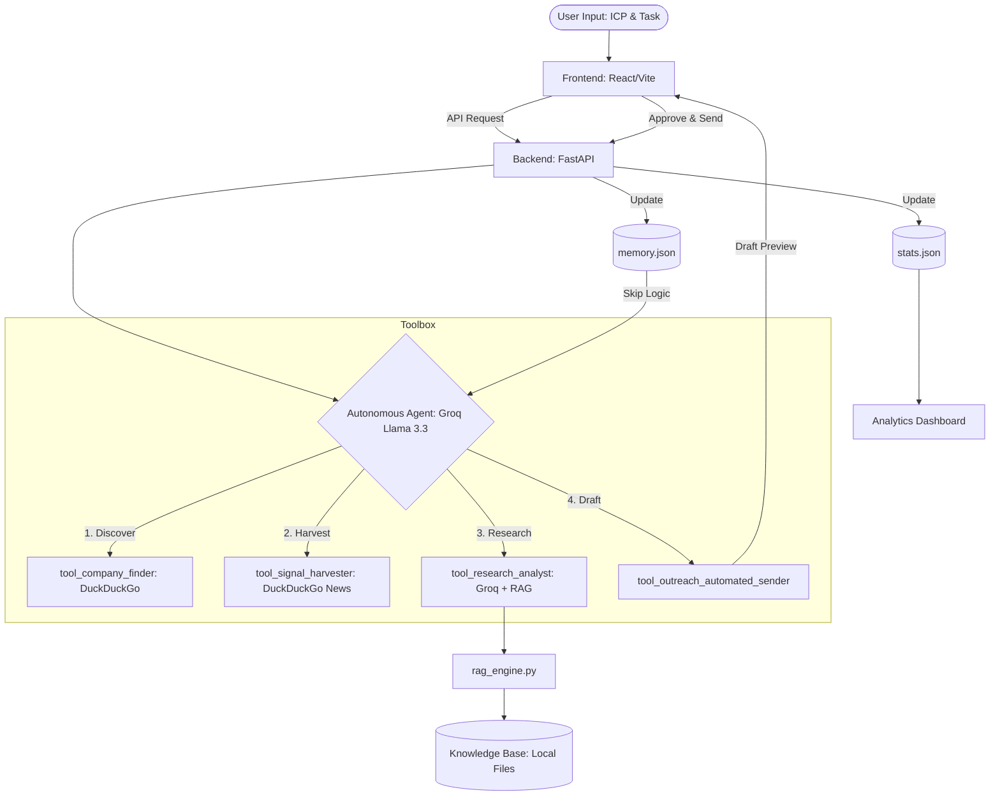

# FireReach: Autonomous AI Outreach Engine

> **Live Demo**: [rabbitt-ai-mu.vercel.app](https://rabbitt-ai-mu.vercel.app)

FireReach is a high-performance, autonomous SDR (Sales Development Representative) engine that discovers leads, harvests real-time business signals, and generates hyper-personalized outreach emails with a human-in-the-loop approval process.

## 🏗 System Architecture

## 🚀 Features

- **Autonomous Discovery**: Find companies matching your Ideal Customer Profile.
- **Real-time Signal Harvesting**: Live web search for funding news, hiring, and expansion.
- **RAG Integration**: Pulls internal product knowledge to align outreach with company expertise.
- **Persistent Memory**: Automatically skips companies already contacted.
- **Analytics Dashboard**: Track signals detected, emails generated, and dispatches in real-time.
- **Human-in-the-loop**: High-conversion emails are drafted and approved before sending.

## 🛠 Tech Stack

- **Large Language Model**: Groq (Llama 3.3 70B)
- **Backend**: Python, FastAPI, Uvicorn
- **Frontend**: React, TypeScript, Vite, Tailwind CSS
- **Data Retrieval**: DuckDuckGo Search API
- **Persistence**: File-based JSON (Stats/Memory)

## 📦 Setup Instructions

### Backend
1. Navigate to `/backend`.
2. Install dependencies: `pip install -r requirements.txt`.
3. Create a `.env` file with your `GROQ_API_KEY`.
4. Run the server: `python main.py`.

### Frontend
1. Navigate to `/frontend`.
2. Install dependencies: `npm install`.
3. Create a `.env` file with `VITE_API_URL=http://localhost:8000`.
4. Run the dev server: `npm run dev`.

---
*Built with ❤️ for advanced agentic outreach.*
